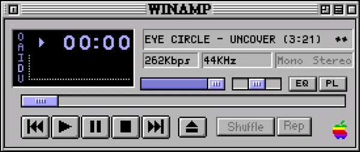

<h1 align="center">⍯ 𝚊𝚋𝚘𝚞𝚝 𝚖𝚎</h1>

<table border="0">
<tr><td>ᯓ cybersec-newbie , designer, and innovator</td></tr>
<tr><td>ᯓ in pursuit of yearning and learning new knowledge</td></tr>
<tr><td>ᯓ all about making a meaningful difference</td></tr>
<tr><td>ᯓ & thinkin' outside the box</td></tr>
</table>

# ◈ 𝚒'𝚟𝚎 𝚍𝚊𝚋𝚋𝚕𝚎𝚍 𝚒𝚗 ... 
                                                    

# ⌬ 𝚖𝚢 𝚐𝚒𝚝𝚑𝚞𝚋 𝚜𝚝𝚊𝚝𝚜 ...

  

<!-- created with GPRM ( https://gprm.itsvg.in ) -->
<!-- images from pinterest -->
